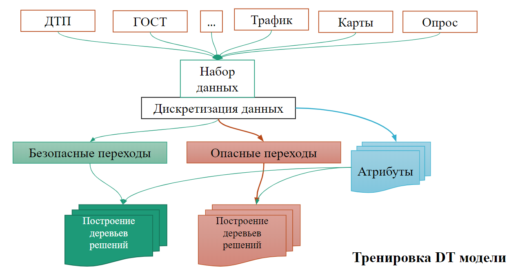
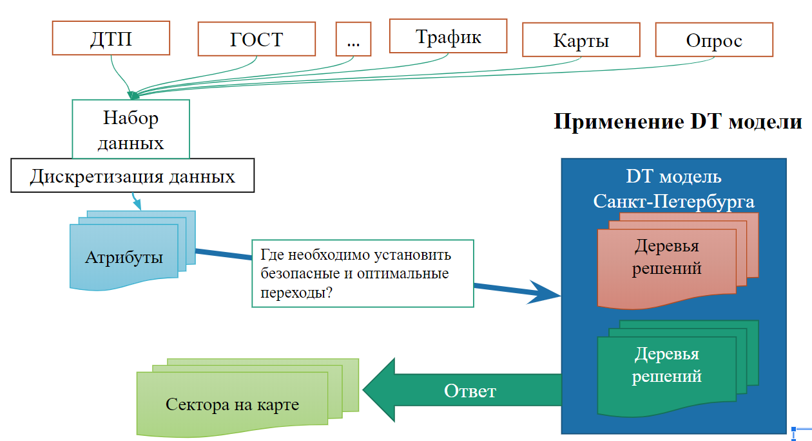

# SPiterDT 
**Разработка методики автоматизированного выявления мест вероятного пересечения пешеходами улиц**
* **Выполнила:** Арутюнян М.А., студентка группы U42751 
* **Научный руководитель:** Будрина Е. В., д.э.н., профессор Университета ИТМО
* **Внешний научный руководитель:** д-р А.Халатян, eScience-Supercomputing, AIP
Предлагаемый нами (автором) инновационный метод основан на алгоритме машинного обучения «Дерево принятия решений» (Decision Trees (DT)), где мы обучаем наш алгоритм существующим «хорошим» и «плохим» пешеходным переходам 
в анализируемом городе, в частности в Санкт-Петербурге. 

После того как алгоритм будет обучен существующей ситуации в Санкт-Петербурге, мы сможем прогнозировать 
и дать рекомендации по установке безопасных и оптимальных пешеходных переходов 
на тех улицах, на которых они расположены либо неоптимально, либо отсутствуют вовсе.

Наша методика основана на принципе «Сначала учись «Что такое хорошо и что такое плохо?» – как писал В.В. Маяковский, а затем отвечай».

# The Algorith

# Usage
Test on colab : 
</li>
 
more coming soon...
